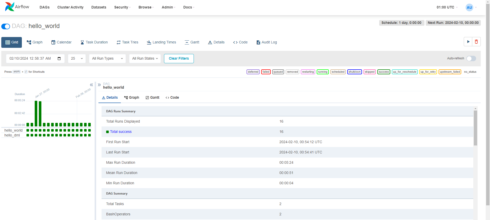

# Kubernetes Helm Airflow

This repository contains the necessary configuration files and DAGs (Directed Acyclic Graphs) for setting up a robust data engineering environment using Kubernetes and Apache Airflow. It includes the setup for the Kubernetes Dashboard, which provides a user-friendly web interface for managing Kubernetes clusters, and Apache Airflow, a platform to programmatically author, schedule, and monitor workflows.

## DAGs

- `hello.py`: A simple example DAG to demonstrate basic Airflow concepts.

## Kubernetes (k8s) Configuration

- `dashboard-adminuser.yaml`: YAML file for setting up an admin user for the Kubernetes Dashboard.
- `dashboard-clusterrole.yaml`: YAML file defining the cluster role for the Kubernetes Dashboard.
- `dashboard-secret.yaml`: YAML file for managing secrets used by the Kubernetes Dashboard.
- `recommended-dashboard.yaml`: YAML file for deploying the recommended Kubernetes Dashboard setup.
- `values.yaml`: YAML file containing values for customizing the Kubernetes setup.

## Getting Started

### Prerequisites

- A Kubernetes cluster
- `kubectl` installed and configured
- Helm (optional, but recommended for managing Kubernetes applications)

### Setup

1. **Deploy the Kubernetes Dashboard:**
   
   To deploy the Kubernetes Dashboard, apply the YAML files in the `k8s` directory:
   
   ```bash
   kubectl apply -f k8s/ --validate=false
   ```
   
   This will set up the Kubernetes Dashboard with the necessary roles and permissions.

2. **Accessing the Kubernetes Dashboard:**
   
   To access the Dashboard, you may need to start a proxy server:
   
   ```bash
   kubectl proxy
   ```
   
   Then, access the Dashboard at `http://localhost:8001/api/v1/namespaces/kubernetes-dashboard/services/https:kubernetes-dashboard:/proxy/`.
   
   Use the token generated for the admin user to log in (see `dashboard-secret.yaml`).

3. **Retrieve Dashboard Token using kubectl:**
   
   If you need to access the Kubernetes dashboard and require a token for authentication, you can retrieve it using `kubectl`. Use the following command:
   
   ```bash
   kubectl get secret admin-user -n kubernetes-dashboard -o jsonpath="{.data.token}" | base64 --decode > output.txt
   ```
   
   After running this command, you'll find the token required for dashboard login in the `output.txt` file.

4. **Deploy Apache Airflow:**
   
   You can deploy Apache Airflow using Helm or by applying custom YAML files. For Helm:
   
   ```bash
   helm repo add apache-airflow https://airflow.apache.org
   helm install airflow apache-airflow/airflow -f k8s/values.yaml --namespace airflow --create-namespace --debug
   ```
   
   This will deploy Airflow with the settings defined in `values.yaml`.

5. **Access Airflow Webserver via Port Forwarding:**
   
   To access the Apache Airflow webserver interface from your local machine, you can use `kubectl` to set up port forwarding. Execute the following command:
   
   ```bash
   kubectl port-forward svc/airflow-webserver 8080:8080 --namespace airflow
   ```
   
   Once you run this command, you can access the Airflow web UI by navigating to `http://localhost:8080` in your web browser. This will route the traffic from your local machine's port 8080 to the Airflow webserver's port 8080 in the Kubernetes cluster.

6. **Accessing Airflow:**
   
   - **Login Credentials**: Go to `http://localhost:8080` and type the Username `admin` and password `admin`.
   - **Dashboard Overview**: After logging in, you will see the main page displaying a DAG: `hello_world`.
     - **Activating `hello_world` DAG**: Toggle the start button for `hello_world` and click on it to view DAG details.
       

7. **Uninstall Apache Airflow:**
   
   If you need to uninstall Apache Airflow, you can do so using Helm with the following command:
   
   ```bash
   helm uninstall airflow -n airflow
   ```
   
   This command removes the Airflow deployment from the specified namespace (`airflow` in this case).

### Usage

- **Kubernetes Dashboard:** Use the Dashboard to monitor and manage the Kubernetes cluster.
- **Apache Airflow:** Access the Airflow web UI to manage, schedule, and monitor workflows.